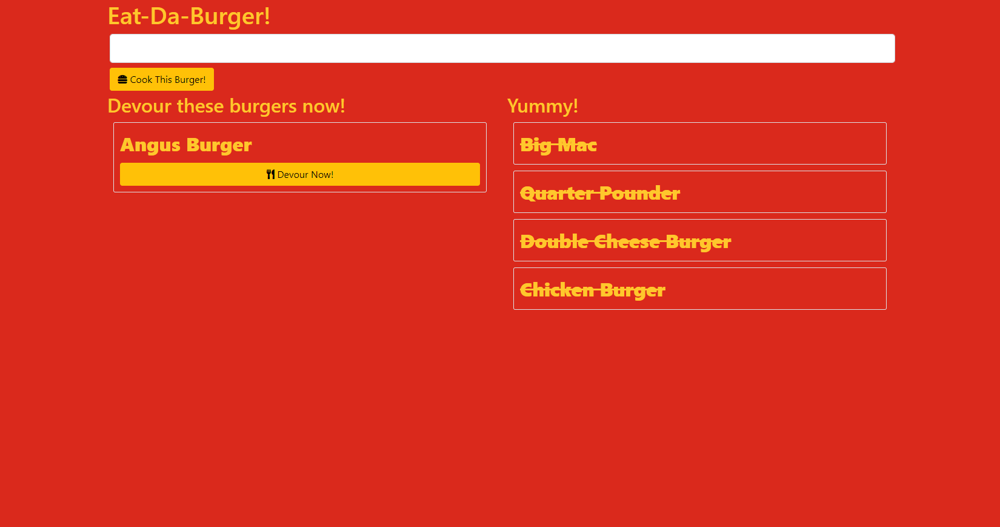

# Eat-Da-Burger!
 [](https://opensource.org/licenses/MIT)

## Deployed at Heroku
https://dragontalker-eat-da-burger.herokuapp.com/

## Link from My Developer Portfolio
This project can be found under the portfolio section at https://dragontalker.github.io/FullStack-DeveloperPortfolio/.

## Screenshot


## Table of Contents
* [Description](#Description)
* [Installation](#Installation)
* [Usage](#Usage)
* [Contact](#Contact)
* [License](#License)


### Description

Eat-Da-Burger! is a burger logger built with MySQL, Node, Express, Handlebars and a homemade ORM (yum!). Any burger added by the user will be listed in the left, and moved to the list on the right once the devour button is clicked. The purpose of this project is to demonstrate the application of the MVC design pattern and usage of Express handlebars rending.

## Technology Used
* Node.js
* Express.js
* MySQL
* RESTful API
* HTML 5
* CSS 3
* Javascript
* Handlebars.js
* Heroku

### Installation
To use this application, type this command in console to install the require packages:

```bash
npm install
```

For MySQL database, build the local database using the `schema.sql` and `seeds.sql` under `db` directory.

### Usage
To initialize the server, type this command in console, then use the application through brower.

```bash
node server.js
```

## Contact
If you have any questions, email me at richard.yang.tong@gmail.com.

## License
Copyright (c) [2021] [Richard Yang]

Permission is hereby granted, free of charge, to any person obtaining a copy of this software and associated documentation files (the "Software"), to deal in the Software without restriction, including without limitation the rights to use, copy, modify, merge, publish, distribute, sublicense, and/or sell copies of the Software, and to permit persons to whom the Software is furnished to do so, subject to the following conditions:

The above copyright notice and this permission notice shall be included in all copies or substantial portions of the Software.

THE SOFTWARE IS PROVIDED "AS IS", WITHOUT WARRANTY OF ANY KIND, EXPRESS OR IMPLIED, INCLUDING BUT NOT LIMITED TO THE WARRANTIES OF MERCHANTABILITY, FITNESS FOR A PARTICULAR PURPOSE AND NONINFRINGEMENT. IN NO EVENT SHALL THE AUTHORS OR COPYRIGHT HOLDERS BE LIABLE FOR ANY CLAIM, DAMAGES OR OTHER LIABILITY, WHETHER IN AN ACTION OF CONTRACT, TORT OR OTHERWISE, ARISING FROM, OUT OF OR IN CONNECTION WITH THE SOFTWARE OR THE USE OR OTHER DEALINGS IN THE SOFTWARE.
